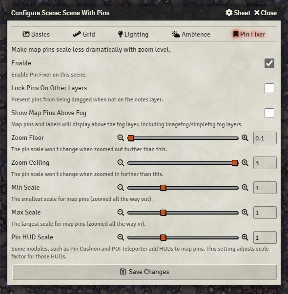

# Pin Cushion


 

[](https://forge-vtt.com/bazaar#package=pin-cushion) 


[](https://www.foundryvtt-hub.com/package/pin-cushion/)


Modifies the behaviour of map pins (Notes) so that they do not become too small to see when the map is zoomed out, or so large that they cover everything when zoomed in.

Scale factors and limits are configurable per-scene via the Scene Config menu.



With the default settings above, pins will remain the same on-screen size at all times. By increasing the Max Scale, they will become larger when zoomed it, by decreasing the Min Scale, they will become smaller when zoomed out. The Zoom Floor and Ceiling are hard cut-offs, beyond which no further scaling will occur.

*Example:* If you wish to have pins get no larger than 2x normal size, no smaller than .75x normal size, and not get smaller when the canvas is scaled smaller than .5, your settings are (in order): `.75, 2, .5, 3`.

## Installation

It's always easiest to install modules from the in game add-on browser.

To install this module manually:
1.  Inside the Foundry "Configuration and Setup" screen, click "Add-on Modules"
2.  Click "Install Module"
3.  In the "Manifest URL" field, paste the following url:
`https://raw.githubusercontent.com/p4535992/foundryvtt-pin-cushion/master/module.json`
4.  Click 'Install' and wait for installation to complete
5.  Don't forget to enable the module in game using the "Manage Module" button

## Known issue

### libWrapper

This module uses the [libWrapper](https://github.com/ruipin/fvtt-lib-wrapper) library for wrapping core methods. It is a hard dependency and it is recommended for the best experience and compatibility with other modules.

## Settings
- **ffè**: 

## Features

### Pin Locker
An additional setting "Lock Pins On Other Layers" prevents pins from being moved around accidentally. Whith this feature enabled, it is only possible to move pins while on the "Journal Notes" layer. 

### Show Pins Above Fog
Map pins and labels will display above the fog layer, including imagefog/simplefog fog layers.

### Pin Hiding
You can configure individual pins to become hidden completely at certain zoom levels. Additional fields are added to the Note Config (double right click the note). Hidden notes still appear on the Notes layer.

### Always Show Pin Label
When this option is enabled, the label of the pin will always be shown if the pin is visible, rather than only when it is hovered over.

### HUD Scaling
The last setting pertains only to other modules that add a HUD to map pins. It tweaks these HUDs so they remain the same size as the map zooms in and out, you can configure this static size to be larger/smaller than normal by setting the scale value. A value of 1 is the default size that the module normally shows its HUD.

# Build

## Install all packages

```bash
npm install
```
## npm build scripts

### build

will build the code and copy all necessary assets into the dist folder and make a symlink to install the result into your foundry data; create a
`foundryconfig.json` file with your Foundry Data path.

```json
{
  "dataPath": "~/.local/share/FoundryVTT/"
}
```

`build` will build and set up a symlink between `dist` and your `dataPath`.

```bash
npm run-script build
```

### NOTE:

You don't need to build the `foundryconfig.json` file you can just copy the content of the `dist` folder on the module folder under `modules` of Foundry

### build:watch

`build:watch` will build and watch for changes, rebuilding automatically.

```bash
npm run-script build:watch
```

### clean

`clean` will remove all contents in the dist folder (but keeps the link from build:install).

```bash
npm run-script clean
```
### lint and lintfix

`lint` launch the eslint process based on the configuration [here](./.eslintrc)

```bash
npm run-script lint
```

`lintfix` launch the eslint process with the fix argument

```bash
npm run-script lintfix
```

### prettier-format

`prettier-format` launch the prettier plugin based on the configuration [here](./.prettierrc)

```bash
npm run-script prettier-format
```

### package

`package` generates a zip file containing the contents of the dist folder generated previously with the `build` command. Useful for those who want to manually load the module or want to create their own release

```bash
npm run-script package
```

## [Changelog](./changelog.md)

## Issues

Any issues, bugs, or feature requests are always welcome to be reported directly to the [Issue Tracker](https://github.com/p4535992/foundryvtt-pin-cushion/issues ), or using the [Bug Reporter Module](https://foundryvtt.com/packages/bug-reporter/).

## License

- [Pin Fixer](https://github.com/zeel01/pin-fixer) ([MIT](https://github.com/zeel01/pin-fixer/blob/master/LICENSE))

This package is under an [MIT](LICENSE) and the [Foundry Virtual Tabletop Limited License Agreement for module development](https://foundryvtt.com/article/license/).

## Acknowledgements

- Thank you to [zeel](https://github.com/zeel01) for the module [Pin Fixer](https://github.com/zeel01/pin-fixer)
