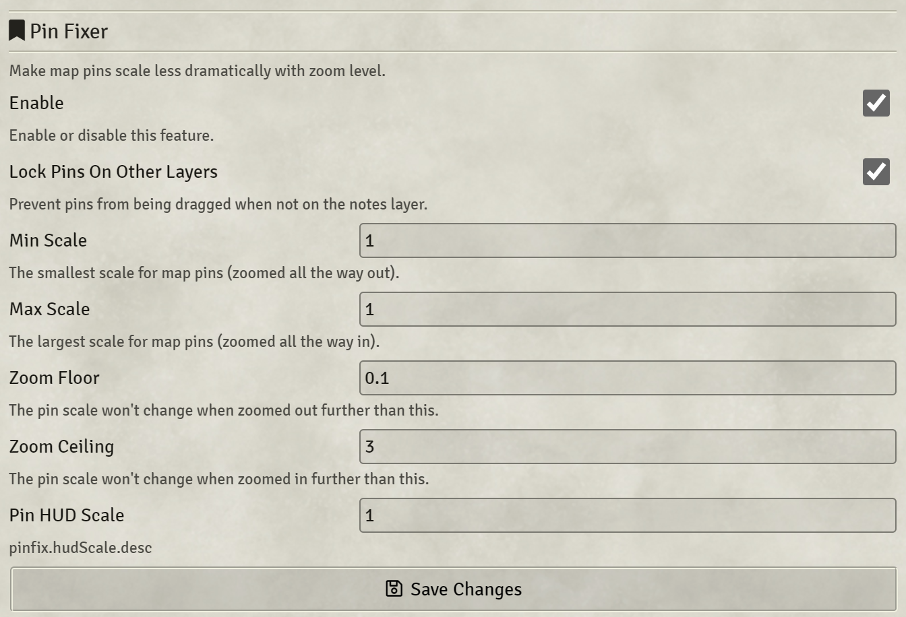

## Pin Fixer
Modifies the behaviour of map pins (Notes) so that they do not become too small to see when the map is zoomed out, or so large that they cover everything when zoomed in.

Scale factors and limits are configurable per-scene via the Scene Config menu.

With the default settings above, pins will remain the same on-screen size at all times. By increasing the Max Scale, they will become larger when zoomed it, by decreasing the Min Scale, they will become smaller when zoomed out. The Zoom Floor and Ceiling are hard cut-offs, beyond which no further scaling will occur.

*Example:* If you wish to have pins get no larger than 2x normal size, no smaller than .75x normal size, and not get smaller when the canvas is scaled smaller than .5, your settings are (in order): `.75, 2, .5, 3`.

### Pin Locker
An additional setting "Lock Pins On Other Layers" prevents pins from being moved around accidentally. Whith this feature enabled, it is only possible to move pins while on the "Journal Notes" layer. 

## Pin Hiding
You can configure individual pins to become hidden completely at certain zoom levels. Additional fields are added to the Note Config (double right click the note).
### HUD Scaling
The last setting pertains only to other modules that add a HUD to map pins. It tweaks these HUDs so they remain the same size as the map zooms in and out, you can configure this static size to be larger/smaller than normal by setting the scale value. A value of 1 is the default size that the module normally shows its HUD.

### Installation
Either install using the module browser in Foundry, or install via manifest:
> [https://raw.githubusercontent.com/zeel01/pin-fixer/master/module.json](https://raw.githubusercontent.com/zeel01/pin-fixer/master/module.json)

#### *Commissioned by GloriousGe0rge from CORSAIR*